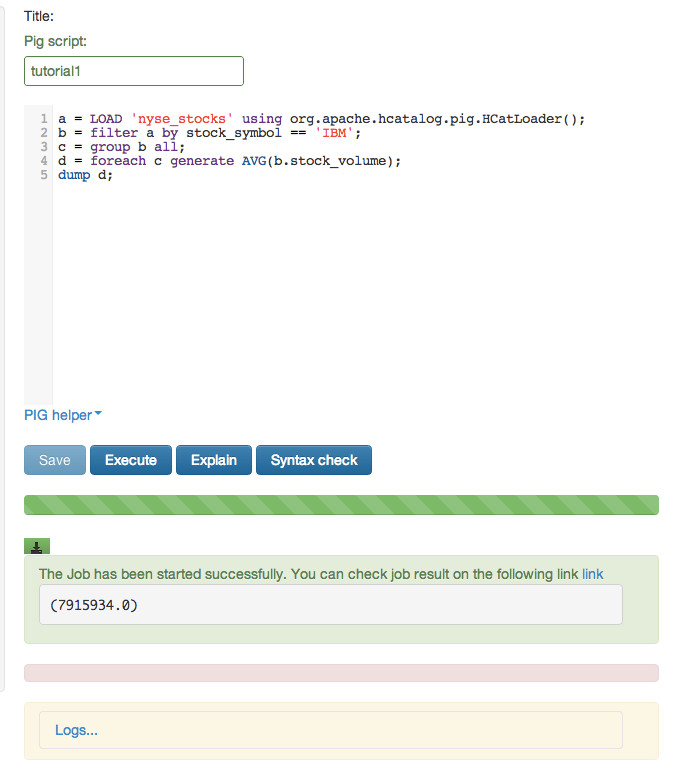
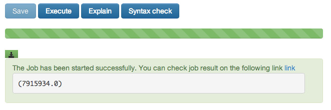

## Tutorial 1: Hello World - An Overview Using the Hortonworks Sandbox with HCatalog, Hive and Pig

**This tutorial is from the [Hortonworks Sandbox](http://hortonworks.com/products/sandbox) - a single-node Hadoop cluster running in a virtual machine. Download to run this and other tutorials in the series.**

The tutorials are presented in sections as listed below.

-   [Overview of Apache Hadoop and Hortonworks Data Platform](#overview)
-   [Using HDP](#usingHDP)
-   [Loading the sample data into HCatalog](#loading)
-   [A Short Apache Hive Tutorial](#hive)
-   [Pig Basics Tutorial](#pig)

###Overview of Apache Hadoop and Hortonworks Data Platform

The Hortonworks Sandbox is a single node implementation of the
Hortonworks Data Platform(HDP). It is packaged as a virtual machine to
make evaluation and experimentation with HDP fast and easy. The
tutorials and features in the Sandbox are oriented towards exploring how
HDP can help you solve your business big data problems. The Sandbox
tutorials will walk you through bringing some sample data into HDP and
manipulate it using the tools built into HDP. The idea is to show you
how you can get started and show you how to accomplish tasks in HDP. HDP
is free to download and use in your enterprise and you can download it
here: [Hortonworks Data Platform
Download](http://hortonworks.com/download/)

The Apache Hadoop projects provide a series of tools designed to solve
big data problems. The Hadoop cluster implements a parallel computing
cluster using inexpensive commodity hardware. The cluster is partitioned
across many servers to provide a near linear scalability. The philosophy
of the cluster design is to bring the computing to the data. So each
datanode will hold part of the overall data and be able to process the
data that it holds. The overall framework for the processing software is
called MapReduce. Here's a short video introduction to MapReduce:
[Introduction to MapReduce](http://www.youtube.com/watch?v=ht3dNvdNDzI)

Apache Hadoop can be useful across a range of use cases spanning
virtually every vertical industry. It is becoming popular anywhere that
you need to store, process, and analyze large volumes of data. Examples
include digital marketing automation, fraud detection and prevention,
social network and relationship analysis, predictive modeling for new
drugs, retail in-store behavior analysis, and mobile device
location-based marketing.

The Hadoop Distributed File System
----------------------------------

In this section we are going to take a closer look at some of the
components we will be using in the Sandbox tutorials. Underlying all of
these components is the Hadoop Distributed File System(HDFS™). This is
the foundation of the Hadoop cluster. The HDFS file system manages how
the datasets are stored in the Hadoop cluster. It is responsible for
distributing the data across the datanodes, managing replication for
redundancy and administrative tasks like adding, removing and recovery
of datanodes.

### Apache Hive™

The Apache Hive project provides a data warehouse view of the data in
HDFS. Using a SQL-like language Hive lets you create summarizations of
your data, perform ad-hoc queries, and analysis of large datasets in the
Hadoop cluster. The overall approach with Hive is to project a table
structure on the dataset and then manipulate it with HiveQL. Since you
are using data in HDFS your operations can be scaled across all the
datanodes and you can manipulate huge datasets.

### Apache HCatalog

The function of HCatalog is to hold location and metadata about the data
in a Hadoop cluster. This allows scripts and MapReduce jobs to be
decoupled from data location and metadata like the schema. Additionally
since HCatalog supports many tools, like Hive and Pig, the location and
metadata can be shared between tools. Using the open APIs of HCatalog
other tools like Teradata Aster can also use the location and metadata
in HCatalog. In the tutorials we will see how we can now reference data
by name and we can inherit the location and metadata.

### Apache Pig™

Pig is a language for expressing data analysis and infrastructure
processes. Pig is translated into a series of MapReduce jobs that are
run by the Hadoop cluster. Pig is extensible through user-defined
functions that can be written in Java and other languages. Pig scripts
provide a high level language to create the MapReduce jobs needed to
process data in a Hadoop cluster.

That‘s all for now... let‘s get started with some examples of using
these tools together to solve real problems!

###Using HDP

Here we go! We're going to walk you through a series of step-by-step
tutorials to get you up and running with the Hortonworks Data
Platform(HDP).

### Downloading Example Data

We'll need some example data for our lessons. For our first lesson,
we'll be using stock ticker data from the New York Stock Exchange from
the years 2000-2001. You can download this file here:

[https://s3.amazonaws.com/hw-sandbox/tutorial1/NYSE-2000-2001.tsv.gz](https://s3.amazonaws.com/hw-sandbox/tutorial1/NYSE-2000-2001.tsv.gz)

The file is about 11 megabytes, and may take a few minutes to download.
Fortunately, to learn 'Big Data' you don't have to use a massive
dataset. You need only use tools that scale to massive datasets. Click
and save this file to your computer.

### Using the File Browser

You can reach the File Browser by clicking its icon:

The File Browser interface should be familiar to you as it is similar to
the file manager on a Windows PC or Mac. We begin in our home directory.
This is where we'll store the results of our work. File Browser also
lets us upload files.

### Uploading a File

To upload the example data you just downloaded,

-   Select the 'Upload' button
-   Select 'Files' and a pop-up window will appear.
-   Click the button which says, 'Upload a file'.
-   Locate the example data file you downloaded and select it.
-   A progress meter will appear. The upload may take a few moments.

When it is complete you'll see this:

Now click the file name "NYSE-2000-2001.tar.gz". You'll see it,
displayed in tabular form:

You can use File Browser just like your own computer's file manager.
Next register the dataset with HCatalog.

###Loading the sample data into HCatalog

Now that we've uploaded a file to HDFS, we will register it with
HCatalog to be able to access it in both Pig and Hive.

Select the HCatalog icon in the icon bar at the top of the page:

Select "Create a new table from file" from the Actions menu on the left.

Fill in the Table Name field with 'nyse\_stocks'. Then click on Choose a
file button. Select the file we just uploaded 'NYSE-2000-2001.tsv.gz'.

You will now see the options for importing your file into a table. The
File options should be fine. In Table preview set all text type fields
to Column Type 'string' and all decimal fields (ex: 12.55) to Column
Type 'float.' The one exception is 'stock\_volume' field should be set
as 'bigint.' When everything is complete click on the "Create Table"
button at the bottom.

###A Short Apache Hive Tutorial

In the previous sections you:

-   Uploaded your data file into HDFS
-   Used Apache HCatalog to create a table

Apache Hive™ provides a data warehouse function to the Hadoop cluster.
Through the use of HiveQL you can view your data as a table and create
queries like you would in a database.

To make it easy to interact with Hive we use a tool in the Hortonworks
Sandbox called Beeswax. Beeswax gives us an interactive interface to
Hive. We can type in queries and have Hive evaluate them for us using a
series of MapReduce jobs.

Let‘s open Beeswax. Click on the bee icon on the top bar.

On the right hand side there is a query window and an execute button. We
will be typing our queries in the query window. When you are done with a
query please click on the execute button. Note: There is a limitation of
one query in the composition window. You can not type multiple queries
separated by semicolons.

Since we created our table in HCatalog, Hive automatically knows about
it. We can see the tables that Hive knows about by clicking on the
Tables tab.

In the list of the tables you will see our table, `nyse\_stocks`. Hive
inherits the schema and location information from HCatalog. This
separates meta information like schema and location from the queries. If
we did not have HCatalog we would have to build the table by providing
location and schema information.

We can see the records by typing `Select \* from nyse\_stocks` in the
Query window. 
Our results would be:

We can see the columns in the table by executing `describe nyse\_stocks`

We will then get a description of the nyse table.

We can count the records with the query `select count(\*) from
nyse\_stocks`. You can click on the Beeswax icon to get back to the
query screen. Evaluate the expression by typing it in the query window
and hitting execute.

This job takes longer and you can watch the job running in the log. When
the job is complete you will see the results posted in the Results tab.

You can select specific records by using a query like `select \* from
nyse\_stocks where stock\_symbol="IBM"`.

This will return the records with IBM.

So we have seen how we can use Apache Hive to easily query our data in
HDFS using the Apache Hive query language. We took full advantage of
HCatalog so we did not have to specify our schema or location of the
data. Apache Hive allows people who are knowledgable in query languages
like SQL to immediately become productive with Apache Hadoop. Once they
know the schema of the data can they quickly and easily formulate
queries.

###Pig Basics Tutorial

In this tutorial we create and run Pig scripts. On the left is a list of
scripts that we have created. In the middle is an area for us to compose
our scripts. We will also load the data from the table we have stored in
HCatalog. We will then filter out the records for the stock symbol IBM.
Once we have done that we will calculate the average of closing stock
prices over this period.

The basic steps will be:

-   Step 1: Create and name the script
-   Step 2: Loading the data
-   Step 3: Select all records starting with IBM
-   Step 4: iterate and average
-   Step 5: save the script and execute it

Let's get started...

To get to the Pig interface click on the Pig icon on the icon bar at the
top. This will bring up the Pig user interface. On the left is a list of
your scripts and on the right is a composition box for your scripts.

A special feature of the interface is the Pig helper at the bottom. The
Pig helper will provide us with templates for the statements, functions,
I/O statements, HCatLoader() and Python user defined functions.

At the very bottom are status areas that will show the results of our
script and log files

### Step 1: Create and name the script

-   Open the Pig interface by clicking the Pig icon at the top of the
    screen\

    
-   Title your script by filling in the title box\

    

### Step 2: Loading the data

Our first line in the script will load the table. We are going to use
HCatalog because this allows us to share schema across tools and users
within our Hadoop environment. HCatalog allows us to factor out schema
and location information from our queries and scripts and centralize
them in a common repository. Since it is in HCatalog we can use the
HCatLoader() function. Pig makes it easy by allowing us to give the
table a name or alias and not have to worry about allocating space and
defining the structure. We just have to worry about how we are
processing the table.

-   On the right hand side we can start adding our code at Line 1
-   We can use the Pig helper at the bottom of the screen to give us a
    template for the line. Click on `Pig helper -\> HCatalog-\>load
    template`
-   The entry `%TABLE%` is highlighted in red for us. Type the name of the
    table which is `nyse-stocks`.
-   Remember to add the `a = ` before the template. This saves the
    results into `a`. Note the `= has to have a space before and after
    it.

Our completed line of code will look like:

    a = LOAD 'nyse_stocks' using org.apache.hcatalog.pig.HCatLoader();

So now we have our table loaded into Pig and we stored it "`a`"

### Step 3: Select all records starting with IBM

The next step is to select a subset of the records so that we just have
the records for stock ticker of IBM. To do this in Pig we use the Filter
operator. We tell Pig to Filter our table and keep all records where
stock\_symbol="IBM" and store this in b. With this one simple statement
Pig will look at each record in the table and filter out all the ones
that do not meet our criteria. The group statement is important because
it groups the records by one or more relations. In this case we just
specified all rather than specify the exact relation we need.

-   We can use Pig Help again by clicking on `Pig helper-\>Data
    processing functions-\>FILTER` template
-   We can replace `%VAR%` with "`a`" (hint: tab jumps you to the next
    field)
-   Our `%COND% is "`stock\_symbol =='IBM'` " (note: single quotes are
    needed around IBM and don't forget the trailing semi-colon)
-   `Pig helper -\> Data processing functions-\>GROUP BY` template
-   The first `%VAR% is "`b`" and the second `%VAR%` is "`all`". You will need to
    correct an irregularity in the Pig syntax here. Remove the "`BY`" in
    the line of code.
-   Again add the trailing semi-colon to the code.

So the final code will look like:

    b = filter a by stock_symbol == 'IBM';
    c = group b all;
                    

Now we have extracted all the records with IBM as the stock\_symbol.

### Step 4: Iterate and Average

Now that we have the right set of records we can iterate through them
and create the average. We use the "foreach" operator on the grouped
data to iterate through all the records. The AVG() function creates the
average of the stock\_volume field. To wind it up we just print out the
results which will be a single floating point number. If our results
would be used for a future job we can save it back into a table.

-  `Pig helper -\>Data Processing functions-\>FOREACH` template will get
    us the code
-   Our first `%VAR%` is `c` and the second `%VAR%` is "`AVG(b.stock\_volume);`"
-   We add the last line with `Pig helper-\>I/O-\>DUMP` template and
    replace `%VAR%` with "`d`".

Our last two lines of the script will look like:

    d = foreach c generate AVG(b.stock_volume);
    dump d;
                    

So the variable "`d`" will contain the average volume of IBM stock when this
line is executed.

### Step 5: Save the script and Execute it

We can save our completed script using the Save button at the bottom and
then we can Execute it. This will create a MapReduce job(s) and after it
runs we will get our results. At the bottom there will be a progress bar
that shows the job status.

-   At the bottom we click on the Save button again
-   Then we click on the Execute button to run the script
-   Below the Execute button is a progress bar that will show you how
    things are running.
-   When the job completes you will see the results in the green box.
-   Click on the Logs link to see what happened when your script ran.he
    average of stock\_volume This is where you will see any error
    messages. The log may scroll below the edge of your window so you
    may have to scroll down.

### Summary

Now we have a complete script that computes the average volume of IBM
stock. You can download the results by clicking on the green download
icon above the green box.

If you look at what our script has done, you see in Line 5 we:

-   Pulled in the data from our table using HCatalog, we took advantage
    that HCatalog provided us with location and schema information, if
    that needs to change in the future we would not have to rewrite our
    script.
-   Pig then went through all the rows in the table and discarded the
    ones where the stock\_symbol field is not IBM
-   Then an index was built for the remaining records
-   The average of stock\_volume was calculated on the records

We did it with 5 lines of Pig script code!
